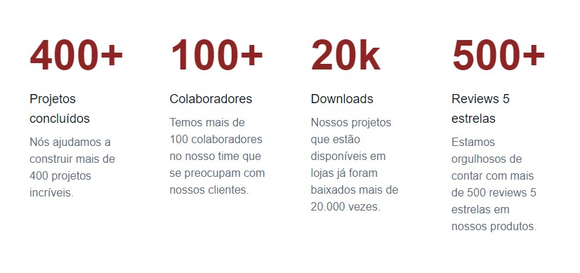
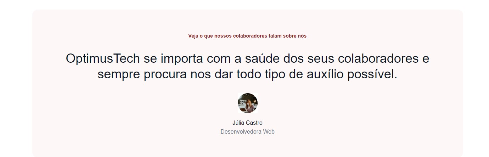
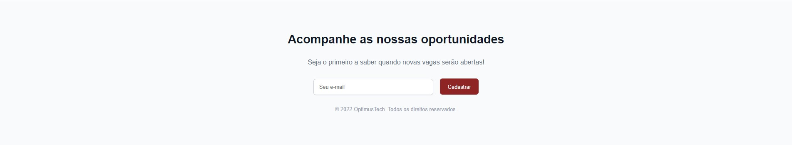

# 7 Days of Code - HTML e CSS

## Site Finalizado! 🥳

🔗 [Clique aqui para acessar](https://luistomasini.github.io/7daysofcode-html-css-vagas/)

## Dia 1 ✅

Contrução do navbar. Obs.: (Fiz correções baseadas nos modelos cedidos pela alura no dia seguinte).

## Dia 2 ✅

Construção do header do site. 

## Dia 3 ✅

Construção da section "metricas"

## Dia 4 ✅

Construção da section "Vagas Abertas!"

## Dia 5 ✅

Construção da section "vagas"

## Dia 6 ✅

Construção da section "depoimentos"

## Dia 7 ✅

Construção do footer
